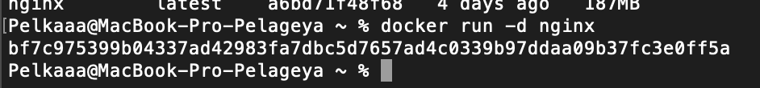
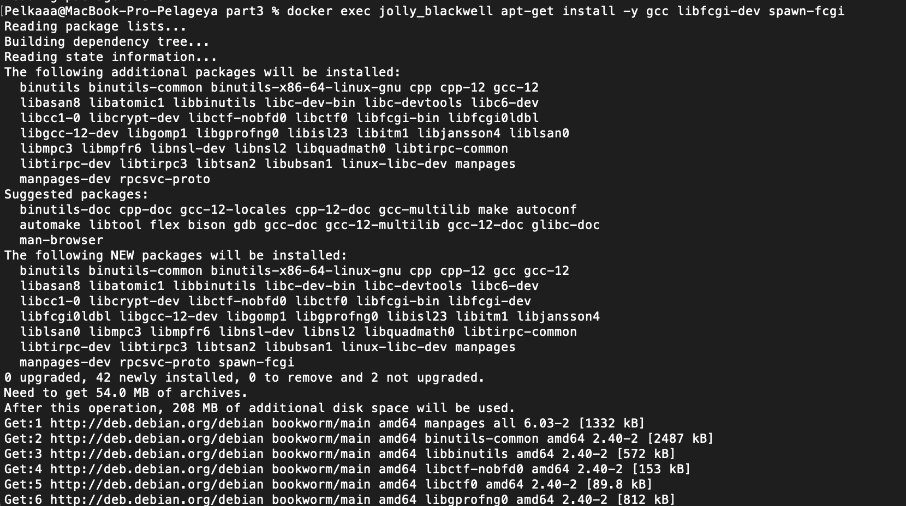
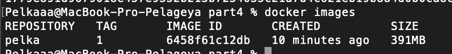

# Simple Docker :raised_hands:

## Contents

1. [:birthday: Готовый докер](#part-1-готовый-докер) 
2. [:honey_pot: Операции с контейнером](#part-2-операции-с-контейнером) 
3. [:cake: Мини веб-сервер](#part-3-мини-веб-сервер) 
4. [:bread: Свой докер](#part-4-свой-докер) 
5. [:baguette_bread: Dockle](#part-5-dockle) 
6. [:pancakes: Базовый Docker Compose](#part-6-базовый-docker-compose)

## Part 1. Готовый докер

**== Задание ==**

* Скачиваем докер на официальном сайте 
* Авторезируемся 

##### Взять официальный докер образ с **nginx** и выкачать его при помощи `docker pull`

##### Проверить наличие докер образа через `docker images`

##### Запустить докер образ через `docker run -d [image_id|repository]`

> -d - запуск контейнера интерактивно или как демона/detached

##### Проверить, что образ запустился через `docker ps`

##### Посмотреть информацию о контейнере через `docker inspect [container_id|container_name]`

##### . . . 

##### По выводу команды определить и поместить в отчёт размер контейнера, список замапленных портов и ip контейнера

##### Остановить докер образ через `docker stop [container_id|container_name]`

##### Проверить, что образ остановился через `docker ps`

##### Запустить докер с портами 80 и 443 в контейнере, замапленными на такие же порты на локальной машине, через команду *run*

> -d - запуск демона в автономном режиме, ибо по замыслу контейнеры, запущенные в отключенном режиме, завершаются при выходе корневого процесса, используемого для запуска контейнера
-p - опубликовать порт контейнера или диапазон портов на хосте.

##### Проверить, что в браузере по адресу *localhost:80* доступна стартовая страница **nginx**

##### Перезапустить докер контейнер через `docker restart [container_id|container_name]`

##### Проверить любым способом, что контейнер запустился

> В отчёт поместить скрины:
  вызова и вывода всех использованных в этой части задания команд;
  стартовой страницы **nginx** по адресу *localhost:80* (адрес должен быть виден).

## Part 2. Операции с контейнером

**== Задание ==**

##### Прочитать конфигурационный файл *nginx.conf* внутри докер контейнера через команду *exec*

##### Создать на локальной машине файл *nginx.conf*

##### Настроить в нем по пути */status* отдачу страницы статуса сервера **nginx**

##### Скопировать созданный файл *nginx.conf* внутрь докер образа через команду `docker cp`

##### Перезапустить **nginx** внутри докер образа через команду *exec*

##### Проверить, что по адресу *localhost:80/status* отдается страничка со статусом сервера **nginx**

##### Экспортировать контейнер в файл *container.tar* через команду *export*

##### Остановить контейнер

##### Удалить образ через `docker rmi [image_id|repository]`, не удаляя перед этим контейнеры

> __-f__ -force - Force removal of the image/Принудительное удаление изображения

##### Удалить остановленный контейнер

##### Импортировать контейнер обратно через команду *import*

> Команда __docker import__ используется для импорта содержимого tar-архива.

>  Опция __--change 'CMD ["nginx", "-g", "daemon off;"]'__ используется для применения инструкций к Dockerfil при создании образа. В данном случае она устанавливает команду по умолчанию (CMD) для запуска Nginx с указанными параметрами. 

> Часть __daemon off__ представляет собой общую конфигурацию для запуска Nginx в режиме переднего плана. Таким образом, эта команда создает новый образ Docker, импортируя содержимое container.tar и устанавливая инструкцию по умолчанию для запуска Nginx с указанной конфигурацией. Важно отметить, что инструкция CMD часто используется для определения исполняемого файла и параметров по умолчанию при запуске контейнера. 

> Опция __-g__ используется для передачи параметра конфигурации веб-серверу Nginx. -g с параметром daemon off; устанавливает конфигурацию Nginx для работы в переднем плане при запуске контейнера.
##### Запустить импортированный контейнер

##### Проверить, что по адресу *localhost:80/status* отдается страничка со статусом сервера **nginx**

>  В отчёт поместить скрины:
   вызова и вывода всех использованных в этой части задания команд;
   содержимое созданного файла *nginx.conf*;
   страницы со статусом сервера **nginx** по адресу *localhost:80/status*.

## Part 3. Мини веб-сервер

**== Задание ==**

##### Написать мини сервер на **C** и **FastCgi**, который будет возвращать простейшую страничку с надписью `Hello World!`

##### Запустить написанный мини сервер через *spawn-fcgi* на порту 8080

* Запускаем на порту 80 и 81, т.к. надо пудет проксировать

``docker run -d -p 80:80 -p 81:81 nginx``

#### Написать свой *nginx.conf*, который будет проксировать все запросы с 81 порта на *127.0.0.1:8080*

##### Положить файл *nginx.conf* по пути *./nginx/nginx.conf* (это понадобится позже)

Конфигурация прописана, осталось добавить файлы в контейнер

``docker cp nginx.conf ___ :/etc/nginx``

``docker cp server.c ___ :/home``

``docker exec ___ nginx -s reload``

* Чтобы запустить написанный мини сервер через spawn-fcgi, нам нужен компилятор 

``docker exec ___ apt-get update``

* Скачиваем нужные пакеты gcc и spawn-fcgi

``docker exec ___ apt-get install -y gcc libfcgi-dev spawn-fcgi``

> Флаг `-y` позволяет избежать появления запросов типа "Вы уверены, что хотите установить этот пакет?" и автоматически подтверждает установку указанных пакетов.

* Компилируем 

``docker exec ___ gcc -o server /home/server.c -lfcgi``

> 
Флаг `-o` в  используется для указания имени файла, в который следует записать результат компиляции. 

* Запускаем 

``docker exec ___ spawn-fcgi -p 8080 ./server``

##### Проверить, что в браузере по *localhost:81* отдается написанная вами страничка

> В качестве результата работы по третьей задаче должны быть предоставлены исходные файлы для запуска веб-сервера.

## Part 4. Свой докер

**== Задание ==**

*При написании докер образа избегайте множественных вызовов команд RUN*

#### Написать свой докер образ, который:
 1) собирает исходники мини сервера на FastCgi из [Части 3](#part-3-мини-веб-сервер)
 2) запускает его на 8080 порту
 3) копирует внутрь образа написанный *./nginx/nginx.conf*
 4) запускает **nginx**.
> _**nginx** можно установить внутрь докера самостоятельно, а можно воспользоваться готовым образом с **nginx**'ом, как базовым._

* Пишем скрипт который скомпилирует и запустит нужный нам файл для сервера и примет конфигурации nginx 

##### Собрать написанный докер образ через `docker build` при этом указав имя и тег

##### Проверить через `docker images`, что все собралось корректно

##### Запустить собранный докер образ с маппингом 81 порта на 80 на локальной машине и маппингом папки *./nginx* внутрь контейнера по адресу, где лежат конфигурационные файлы **nginx**'а (см. [Часть 2](#part-2-операции-с-контейнером))

##### Проверить, что по localhost:80 доступна страничка написанного мини сервера

##### Дописать в *./nginx/nginx.conf* проксирование странички */status*, по которой надо отдавать статус сервера **nginx**

##### Перезапустить докер образ
> Если всё сделано верно, то, после сохранения файла и перезапуска контейнера, конфигурационный файл внутри докер образа должен обновиться самостоятельно без лишних действий

##### Проверить, что теперь по *localhost:80/status* отдается страничка со статусом **nginx**

> В качестве результата работы по четвёртой и пятой задачам должны быть предоставлены докерфайлы.

## Part 5. **Dockle**

**== Задание ==**

##### Просканировать образ из предыдущего задания через `dockle [image_id|repository]`

* ``brew install goodwithtech/r/dockle``

##### Исправить образ так, чтобы при проверке через **dockle** не было ошибок и предупреждений

> В качестве результата работы по четвёртой и пятой задачам должны быть предоставлены докерфайлы.

## Part 6. Базовый **Docker Compose**

**== Задание ==**

##### Написать файл *docker-compose.yml*, с помощью которого:
##### 1) Поднять докер контейнер из [Части 5](#part-5-инструмент-dockle) _(он должен работать в локальной сети, т.е. не нужно использовать инструкцию **EXPOSE** и мапить порты на локальную машину)_
##### 2) Поднять докер контейнер с **nginx**, который будет проксировать все запросы с 8080 порта на 81 порт первого контейнера
##### Замапить 8080 порт второго контейнера на 80 порт локальной машины

##### Остановить все запущенные контейнеры

##### Собрать и запустить проект с помощью команд `docker-compose build` и `docker-compose up`

##### Проверить, что в браузере по *localhost:80* отдается написанная вами страничка, как и ранее

> В качестве результата работы по шестой задаче должен быть предоставлен файл *docker-compose.yml* и нужные для его запуска докерфайлы (если они не были предоставлены ранее).

:upside_down_face:
